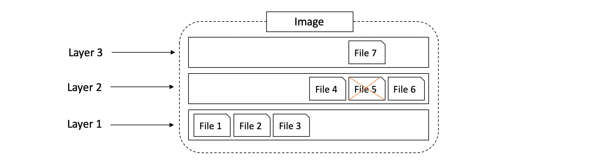
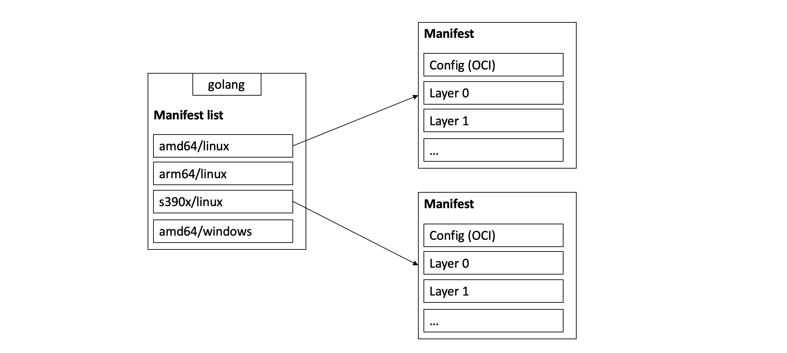
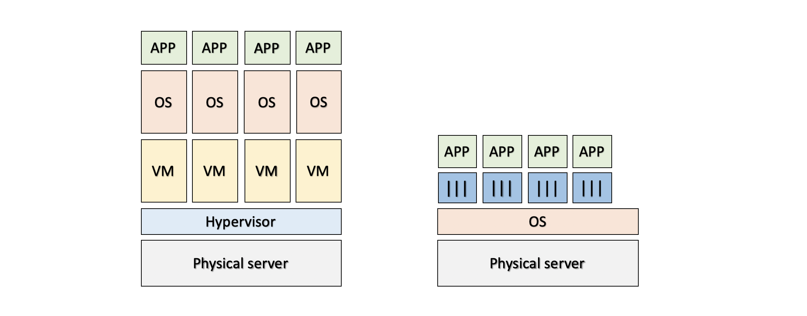

\newpage
The structure of this document is not the same as the one in the book. The installation of Docker is not covered, and only Linux examples are given (no Windows). All the examples can be reproduced with Docker installed on a host, or on Play with Docker (<https://labs.play-with-docker.com/>). The summary is organized as follows: 
\tableofcontents

***

\newpage

```{r setup, include=FALSE, echo=FALSE}
knitr::opts_chunk$set(echo = TRUE)
library(docknitr)
```

# 1. Important concepts and definitions

## The past
Applications run businesses, and most of them run on servers.
In the past, we could only run **1 application per server**. So, new application = buy a new server.
However, nobody knew the performance requirements of the new app -> they bought
big servers, which ended operating at 5-10% of their potential capacity.
It was a waste of resources.

## Virtual machines
Then came the VMs, which allowed running **multiple applications on the same server**.
It was a huge improvement, but there was still a **problem**: every VM requires its own dedicated OS and consume **resources** (CPU, RAM and storage). Also, every OS needs a license, patching and monitoring.
Finally, VMs are slow to boot and portability isn't great (migrating and moving VM workloads between hypervisors and cloudplatforms isn't easy. A hypervisor is a virtualization platform that allows multiple OS to work on the same physical machine).
Nowadays, VMs are still very common.

## Containers
Containers are a trendy virtualization technology that **address the shortcomings of the VM model**.
A container is similar to a VM, but every container does not require its own OS. All containers in a single host share a single OS, freeing up huge amounts of system resources and reducing licensing and monitoring costs.
Unlike VMs, containers are fast to start and ultra-portable: it's easy to move container workloads from a laptop to the cloud, and then to VMs or bare metal in a data center.
There are Linux and Windows containers. It is vital to understand that a running container shares the kernel of the host machine it is running on -> a containerized app designed to run on a host with a Windows kernel will not run on a Linux host.
But in practice, it is actually possible to run Linux containers on Windows machines.

## Images
An image is an **object that contains an OS filesystem and an application** (it's like a VM template). Every container is started from an image. So, an image is in fact a stopped container.
We can either create our own image, or use an existing one to start a container (see for example <https://hub.docker.com/>). Getting images onto the docker host is called "pulling".

## Docker
Containers have existed for a long time, but were complex and out of reach of most organizations.
Docker is the company that **made containers simple**, both for Linux and Windows. It basically creates and manages containers. Note that it is possible to run Linux containers on Mac using Docker for Mac.
With Docker, running an application is as simple as pulling an image and running a container. No need to worry about setup, dependencies, or config... It just works.
Nowadays, Docker is a very popular container runtime but there are many others.
Docker consists of **two major components: the Docker client** and **the Docker engine** (or "daemon"). Once installed, the client-server connection can be tested with the command "docker version".

## Kubernetes
It is an open-source project from Google that has become the leading **orchestrator of containerized apps**.
An orchestrator is a software that helps deploying and managing containers. Kubernetes (k8s) is a higher-level platform than docker, and uses this latter as its default container runtime (it's Docker that starts and stops containers, pulls images, etc.). It is possible to swap out Docker for another container runtime. In the future, k8s might use containerd instead of Docker by default.

## DevOps
The term *DevOps* refers to a movement that aims to unite software development (Dev) and IT operations (Ops). Concretely, it consists of a set of practices that allow to shorten the development life cycle and provide continuous delivery. In a DevOps approach, we try to automate and monitor every step of the creation of a software from the development, integration, tests, delivery and deployment, exploitation and maintenance of infrastructures.
DevOps is an **agile approach** (unlike the waterfall approach), in which the product is developped with the customer.

***

\newpage
# 2. Introduction

Let's introduce Docker in the DevOps perspective. 

## The Ops perspective

We will download an image, start a new container, log in to this container, run a command inside of it, and finally destroy it. The easiest way to reproduce the following commands is on Play with Docker (<https://labs.play-with-docker.com/>).

Let's start by pulling an image:
```{r}
# docker image pull ubuntu:latest
```
Note that "docker pull ubuntu:latest" also works. We can then see the image with the following command:
```{r}
# docker image ls
```
We can refer to the image with its ID (typing the first few characters of the ID is enough for Docker to figure out what image we're referring to). This image contains enough of an OS, code and dependencies to run the application it is designed for. In this case, the image has a stripped-down version of the Ubuntu Linux filesystem.

Now that we have an image, we can launch a container from it. The syntax is *docker container run \<image:version\> \<application/process\>* (we must specifiy an application or process):
```{r}
# docker container run -it ubuntu:latest /bin/bash
```
This command changes the shell prompt: this is because we are now in a Bash Shell on Ubuntu. Here, *docker container run* tells the Docker daemon (server) to start a new container. The flags *-it* tell Docker to make the container interactive and to attach our current shell to the container's terminal. The *\<image:version\>* is the latest version of Ubuntu, and the *\<application\>* we're running is /bin/bash.

In the container, we can list the running processes:
```{r}
# ps -elf
```
There are 2 processes: */bin/bash* and *ps -elf*. However, this latter stopped existing by the time the output was printed. In reality, there is only */bin/bash* running (it is optimal, nothing else is using resources).

We can exit the container with *Ctr-PQ* (it detaches our shell from the terminal of the container) without killing it. This brings us back to our Docker host's terminal, and the container is still running in the background.
Now, if we check again the running processes with *ps -elf*, we see there are more than in the container.

We didn't kill the container, and we can see it with the following command:
```{r}
# docker container ls
```
The container is still running, and we can re-attach to it. The syntax is *docker container exec \<options\> \<container name/ID\> \<command/app\>*:
```{r}
# docker container exec -it determined_nash bash
```
Note that *determined_nash* was the name of my container. let's get out of the container with *Ctrl-PQ* and kill it:
```{r}
# docker container stop determined_nash
# docker container rm determined_nash
# docker container ls -a
```
The flag *-a* in the last command lists all the containers, even the ones that were stopped. It is possible to kill a container in one command, but it is considered a good practice to proceed in two steps. In short, this gives a chance to the application/process to stop properly.

## The Dev perspective

This time, we **focus** more on the **application**: we will clone a nodejs web app from Github, inspect its Dockerfile, containerize it, and run it as a container.
The linux app can be cloned from <https://github.com/nigelpoulton/psweb.git>:
```{r}
# git clone https://github.com/nigelpoulton/psweb.git
```
We can then change directory (with *cd*) into the cloned repo's directory and list its contents:
```{r}
# cd psweb
# ls -al
```
There is a *Dockerfile*, which is a document describing how to build an app into a Docker image. We can see the content of the file with the *cat* command:
```{r}
# cat Dockerfile
```
Each line of this file represents an instruction that is used to build an image. In this case, the instructions are:  
FROM alpine  
LABEL maintainer="nigelpoulton@hotmail.com"  
RUN apk add --update nodejs nodejs-npm  
COPY . /src  
WORKDIR /src  
RUN npm install  
EXPOSE 8080  
ENTRYPOINT ["node", "./app.js"]  

So, we use the **Dockerfile** to **build** a Docker **image**:
```{r}
# docker image build -t test:latest .
```
This commands creates a new image called *test:latest*, and we can make sure it was created with
```{r}
# docker image ls
```
We now have an image with the app inside. We can start a container from this image and test the app:
```{r}
# docker container run -d \
# --name web1 \
# --publish 8080:8080 \
# test:latest
```
To see the result (on Play With Docker), click on the button *OPEN PORT* above the terminal and type 8080 (otherwise open a browser and navigate to localhost:8080).
The process of building an image from code and then building a container from this image is called *containerizing* an app.

***

\newpage
# 3. Technical

## The docker engine (or server)

### Past architecture
At the beginning, the docker engine had two major components:

- **The Docker daemon**: it used to be a monolithic binary that contained all the code for the Docker client, the API, the container runtime, image builds, and much more. This is not what Docker wanted (slow and hard to innovate), and the work of breaking apart the daemon into smaller tools is still an ongoing process. To this day, it has already seen all of the container execution and container runtime code entirely removed. Is is becoming more and more modular, and many components can be swapped, thanks to the OCI (Open Container Initiative) standards.

- **LXC**: provided the daemon with access to fundamental building-blocks of containers that existed in the Linux kernel (*namespaces* and *control groups*). **Problems**: LXC is Linux specific and Docker didn't want to rely on an external tool for the core of the project. They replaced LXC with their own platform-agnostic tool called *libcontainer*, which provides Docker with accesss to the fundamental container building-blocks that exist inside the kernel.

### Current architecture
The **current Docker engine architecture** is the following.


The old monolithic daemon was broken down, giving birth to new layers:

- **runc**: tool that manages container runtime code. It's the reference implementation of the OCI container-runtime-spec. In fact, runc is a CLI wrapper for libcontainer. It has a **single purpose: create containers**.

- **containerd**: tool that used to only manage container **lifecycle operations** (*start*, *stop*, *pause*, *rm*, ...). It now also takes care of **image management** (push and pull, ...).

The daemon still performs image management, image builds, REST API, authentication, security, core networking and orchestration.

### Creation of a container: under the hoods
So, what happens when we create a new container via the docker CLI (the Docker client) ?
```{r}
# docker container run --name ctr1 -it alpine:latest sh
```
Based on Fig. 1, the Docker client converts the command into the appropriate API payload and POSTs it to the correct API endpoit.  
We saw that the REST API is implemented in the Daemon, which is the layer under the Docker client.  
Once the daemon receives the command to create a new container, it makes a call to containerd via a CRUD-style API over gRPC.  
Containerd converts the required Docker image into an OCI bundle and tells runc to use it to create a new container.  
Runc interfaces with the OS kernel to pull together all of the constructs necessary to create a container (namespaces, cgroups, ...). The container process is started as a child-process of runc, and as soon as it is started runc will exit. This means we can run hundreds of containers without having to run hundreds of runc instances.  
Once a container's parent runc process exits, the associated containerd-shim process becomes the container's parent. Among other things, shims have the responsibility to keep any stdin/stdout streams open (so that when the daemon is restarted, the container doesn't terminate due to pipes being closed) and to report the container's exit status back to the daemon.

The **advantage** of this model (code to start and manage containers out of the daemon) is that it makes it possible to **perform maintenance and upgrades on the daemon without impacting running containers**. In the old model, every daemon upgrade would kill all containers on the host.

In Linux, all these components are implemented in separate binaries: *dockerd* (docker daemon), *docker-containerd*, *docker-containerd-shim* and *docker-runc*.

***

\newpage
## Images

Images are like a stopped container. We pull images from an image registry (like Docker Hub), and use it to start one (*docker container run*) or more (*docker service create*) containers.  
Images are made up of **multiple layers** stacked on each other and represented as a single object. They contain a **cut-down OS** and all of the files and dependencies required to run an app. They are usually small and lightweight. For example, the official Alpine Linux Docker image is about 4MB in size! Windows-based images are a little bit different and tend to be bigger.


It is possible to stop a container and create a new image from it: images are considered *build-time* constructs, whereas containers are *run-time* constructs. Once a container is started, the two constructs become dependant on each other. We cannot delete the image until the last container using it has been stopped and destroyed.

On Linux, the image repository is located at */var/lib/docker/\<storage-driver\>*. We can see if our host has any images in its local repository with the following command:
```{r}
# docker image ls
```

### Repositories and pulling images
The syntax to pull an image is *docker image pull \<image\>*. For example:
```{r}
# docker image pull ubuntu:latest
```
We can then check the size and other information with *docker image ls*.

An image registry (like Docker Hub) contains multiple repositories, which can contain multiple images. There are official and unofficial repositories. On Docker Hub, official repositories contain images that have been vetted by Docker -> they contain up-to-date, secure and high-quality code. Unofficial repositories can contain malicious images.
Most of the popular OS and apps have their own official repositories on Docker Hub.

When working with an image from an official repository, the syntax for *docker image pull* is *docker image pull \<repository\>:\<tag\>*.
In the previous command, we pulled the latest image from the ubuntu repository. Note that *:latest* it the default value and it is not necessary to specify it. Also, *latest* isn't necessary the most recent image; for example, the most recent image in the alpine repository is tagged as *edge* (*latest* is the most recent stable image).  
The syntax to pull images from an unofficial repository is *docker image pull \<Docker Hub username/organization\>/\<repository\>:\<tag\>*. Example:
```{r}
# docker image pull nigelpoulton/tu-demo:v2
```

To pull an image from a third party registry (such as Google Container Registry GCR), we need to prepend the repository name with the DNS name of the registy. The last command would become:
```{r}
# docker image pull gcr.io/nigelpoulton/tu-demo:v2
```

Finally, we can pull all of the images in a repository by adding the flag *-a* to the *docker image pull* command. A same image can have different tags (they refer to the same image).

### Filters
The output of *docker image ls* can be filtered with the flag *--filter*. Example:
```{r}
# docker image ls --filter dangling=true
```
A **dangling** image is an image that is no longer tagged, and appears in listings as *\<none\>:\<none\>*. This happens when building a new image and tagging it with an existing tag.
Dangling images can be deleted with the *docker image prune* command. Adding the flag *-a* also removes unused images (not in use by any container).

Filters supported by docker are:

- dangling: true or false  
- before: requires an image name/ID as argument, and returns all images created before it  
- since: same as *before*, but returns images created after the specified image  
- label: filters images based on the presence of a label or label and value.  

The *--format* flag formats the output of the command. Example:
```{r}
# docker image ls --format "{{.Repository}}: {{.Tag}}: {{.Size}}"
```
This command returns all images, but only display repo, tag and size. Note that we can also use tools from the OS such as grep and awk.

We can also search Docker Hub from the CLI with the *docker search* command. For example, we can search all repos with "nigelpoulton" in the "NAME" field:
```{r}
# docker search nigelpoulton
```
Another example with a filter:
```{r}
# docker search alpine --filter "is-official=true"
```
By default, *docker search* displays 25 lines of results. This can be changed with the *--limit* flag.

### Image layers
We saw that images are made up of stacked read-only layers, and represented as a single object. In fact, we see those layers in the output of a *docker image pull* command:
```{r}
# docker image pull ubuntu:latest
```
The output of this command is the following:

latest: Pulling from library/ubuntu  
d51af753c3d3: Pull complete  
fc878cd0a91c: Pull complete  
6154df8ff988: Pull complete  
fee5db0ff82f: Pull complete  
Digest: sha256:747d2dbbaaee995098c9792d99bd333c6783ce56150d1b11e333bbceed5c54d7  
Status: Downloaded newer image for ubuntu:latest  

Each line in this output that ends with "Pull complete" represents a layer in the pulled image. So, this image has 4 layers.  
Another way to see the layers of an image is to inspect it with the *docker image inspect* command:
```{r}
# docker image inspect ubuntu:latest
```
In this output, we see the SHA256 hashes of the 4 layers.

All docker images start with a base layer. Layers are added on top when changes are made or when new content is added. Over-simplified example: we create an image based off Ubuntu Linux 16.04 (first layer) and add the Python package (second layer). Finally, we add a security patch. This would result in the following three layers image:


It's important to understand that the **image** is always the **combination of all layer**s. For example, the last image has 3 layers and each of these layer has some files that are combined.



Here, the overall image only represents 6 files. This is because file 7 in the top layer is an updated version of the file 5 directly below (inline). In this situation, the file in the higher layer obscures the file directly below it. This allows updates versions of files to be added as new layers to the image.

Docker uses a storage driver (snapshotter in newer versions) that is responsible for stacking layers and presenting them as a single unified filesystem. Examples of storage drivers on Linux include *AUFS*, *overlay2*, *devicemapper*, *btrfs* and *zfs*.

The next figure shows the same 3-layer image as it will appear to the system (all 3 layers stacked and merged):


Multiple images share layers, for efficiencies in space and performance. Let's look at the following command:
```{r}
# docker image pull -a nigelpoulton/tu-demo
# docker image ls
```
This command pulls all tagged images in the nigelpoulton/tu-demo repository. In the output, it's written "Already exists" for some layers. This is because Docker recognized that it had copies of some image layers.
Here, docker pulled the *latest* image firt. Then, when it pulled the *v1* and *v2* images, it noticed that it already had some of the layers that make up those images.

So far, we've seen how to pull an image by tag. However, it can be a problem because tags are mutable (it's possible to tag an image with the wrong tag).  
This is where image digests come to the rescue. All images get a cryptographic content hash (immutable), and we refer to it as the *digest*. We can see the digest of an image with:
```{r}
# docker image ls --digests alpine
```
Using the digest ensures that we get exactly the image we expect. At the time of the writing of the book, the only way to determine an image's digest is to pull it by tag and then make a note of its digest. However, this should change in the future.  
An image is just a configuration object that lists the layers and some metadata. The layers are where the data lives. Each layer is independant and has no concept of being part of a collective image.  
Each image is identified by an ID that is a hash of the config object, and each layer is identified by an ID that is a hash of its content -> changing an image or its layers will change those IDs -> image and layers are immutable. We call these hashes content hashes.  
Problem: when we push and pull images, their layers are compressed. This changes their content, and hence their content hashes... So, how can we check that the image we downloaded is safe ?
Each layer also gets a  **distribution hash**, which is the hash of the compressed version of the layer.

### Multi-architecture images
Is the image we're pulling built for the architecture we're running on ? Docker now supports multi-architecture images. This means a single image can have an image for Linux on x64, Linux on PowerPC, Windows x64, ARM, etc... So, a single image tag can support different architectures.
To make this happen, the registry API supports 2 important constructs:

- **Manifest lists**: list of architectures supported by a particular image tag. Each supported architecture has its own manifest.
- **Manifests**: list detailing the layers each architecture is composed from.

Below is an example of the official golang image.



Let's imagine we're running Docker on a Raspberry Pi (Linux running on ARM architecture). When we pull an image, our docker client makes the relevant calls to the Docker Registry API running on Docker Hub. If a manifest list exists for the image, it will be parsed to see if an entry exists for Linux on ARM. If it is the case, the manifest for that image is retrieved and parsed for the crypto ID's of the layers that make up the image.  
Each layer is then pulled from Docker Hub.  
The following example shows how this work by pulling the official golang image:
```{r}
# docker container run --rm golang go version
```
We see the version of Go as well as the CPU architecture of the host. Note that we don't need to tell Docker we need the Linux x64 or Windows x64 versions of the image. Docker takes care of getting the right image for the platform and architecture we're running.
At the time of the writing of the book, all official images have manifest lists.

### Deleting images
Finally, when we're done with an image, we can delete it from our Docker host with the *docker image rm* command. We cannot delete an image that is being used by a running or a stopped container. If an image layer is shared by more than one image, that layer will not be deleted until all images that reference it have been deleted.

For example, we can delete the golang image with (see image with *docker image ls*):
```{r}
# docker image rm golang
```
Note that we could also use the image ID (just the few first characters).
We can delete all image on a docker host with the following command:
```{r}
# docker image rm $(docker image ls -q) -f
```
because *docker image ls -q* returns a list containing just the images IDs.

***

\newpage
## Containers

A container is the **execution environment of an image**. We can start one or more containers from an image. We can create our own images or start from an existing one (see <https://hub.docker.com/> for example).

Before looking at the commands for containers, let's see the differences between containers and VMs in detail.
To illustrate this difference, we will imagine the following situation: we want to run 4 applications on a physical server (both need a host such as a laptop, a bare metal server, etc). How does the scenario differ between VMs and containers?

### The VM model
In the VM model, the physical server and the hypervisor (a virtulization platform that allows multiple OS to work on the same physical machine) are started. The hypervisor uses the physical resources of the system (CPU, RAM, storage, ...). Then, it carves these resources into virtualized ones in order to create a software called a *virtual machine*. In our scenario, this process is replicated 4 times. We have to install an OS and our application on each of the 4 VMs.

### The container model
When the server is started, our chosen OS also starts. The OS also uses physical resources. Then, we install a *container engine* (for example Docker) over the OS. A container engine is in fact an OS whose kernel allows the existence of several isolated instance, the containers. Docker uses resources of the OS such as processes, the file system and the network stack to create one or more containers.  
Each container looks drop for drop like a real OS, and we can run an application in each of them. In our scenario, we create 4 containers.

The image below shows the differencess between the 2 models.



So, a **hypervisor virtualizes hardware, while containers virtualize an OS**. It is very important to understand that **containers share the host OS**. In theory, an application developped for Linux containers will not work on Windows (although it's possible in practice).

So far, it seems that the two models are quite identical. However, we see on the image above that each VM is a software that contains a virtual CPU, a virtual RAM, virtual storage disks, and so on.  
Those virtual resources are handled by an OS, and the problem is that every OS consumes CPU, RAM, storage, etc. Those OS also require a licence, patching, monitoring, and are vulnerable attack vectors...  
This is what we call the **VM tax**: each OS that we install consumes resources. 

The advantage of the container model is that it has a single kernel that runs on the host's OS, and this single OS can run hundreds of containers. This means there is only one OS consuming resources, one license, one possible vector of attack, etc. Also, containers contain lightweight OS with no kernel (which is shared with the host and already started); they start way faster than a VM. The time to start a container only depends on the time required to start the application it runs.  
This difference becomes more and more as the number of applications increases. 

All those differences are in favor of the container model.

### Running containers
Let's see the commands to run containers. The following examples can be replicated on any Docker host or on Play with Docker (<https://labs.play-with-docker.com/>).

The syntax to create a container is *docker container run \<options\> \<image\>:\<tag\> \<app\>*. Example:
```{r}
# docker container run -it ubuntu /bin/bash
```
We're in the container and the 12 digits after *@* are the first 12 digits of the container's ID.
We see that the daemon didn't find the image locally (in cache), so it pulled it from Docker Hub and cached it. We can see it by exiting the container with *Ctrl+d* and by rerunning the previous command.  

The command above starts a Linux container with Bash shell.  
The flag *-it* connects our terminal to the container's shell and makes it interactive.  
We didn't specify the *\<tag\>*, and it takes the *latest* image of ubuntu by default. We can check we're in Linux with the command *uname*, and in Ubuntu with *uname -v*.  
Finally, we asked to run Bash shell, that's why we can use commands such as *ls*, *cd*, and so on. However, some commands don't work because the image is optimized for containers and doesn't contain all the commands and packages... For example, the command *nano file.txt* won't work.

So, running containers is very easy, fast and platform-agnostic.

### Container processes
In the previous example, we started a container that runs Bash shell. It was the single and unique process running in the container. We can see it with the command *ps -elf*: there is ps -elf itself, but it is dead by the time it is displayed. Windows containers are a little bit different and run more processes.

If we use the command *exit* to get out of Bash shell, we also exit the container -> a container cannot live without running a process (same for Windows if we kill the main process).

So, how can we exit a container without killing it ? Use the command *Ctrl -PQ*, which brings us back to our docker host's shell. The container still runs in the background, as shown by the command:
```{r}
# docker container ls
```
We can attach back to the container with the command:
```{r}
# docker container exec -it <ID> bash
```
"exec" let us run a new process inside of a running container. If we execute *ps -elf* again, we now see 2 bash: this is because the previous command creates a new bash process to which we attach. If we exit this bash, it doesn't kill the container.
The container runs until the app it runs stops, or until we stop or kill it. 
We can see it by running the following command:
```{r}
# docker container run alpine:latest sleep 10
```

Finally, we can stop and kill a container with the 2 following commands:
```{r}
# docker container stop <ID>
# docker container rm <ID>
```
We saw it is a good practice to proceed in two steps, although it is possible to do it with one command (*docker container rm -f*). In fact, *docker container stop* sends a **SIGTERM** signal to the PID 1 process inside of the container. In then have 10 seconds to clean things up and shut itself down. If it doesn't exit within 10 seconds, it will receive a **SIGKILL**.

### Containers lifecycle
It is a myth that containers can't persist data. let's look at the lifecycle of an Ubuntu container.

```{r}
# docker container run --name persi -it ubuntu:latest /bin/bash
```
We create a container called "persi" in which we'll write data. Inside the container:

cd /tmp  
ls -al  
echo “foobar” > newfile.txt  
ls -al  
cat newfile.txt  

Now, we get out of the container with *Ctrl -PQ*, and check it is still here with *docker container ls*. We even stop the container:
```{r}
# docker container stop <ID/name>
```
And check once again its presencee with *docker container ls*. It's not here... To see stopped containers, we need to add the flag *-a*:
```{r}
# docker container ls -a
```
We see in its status that it's "exited". Although it's not running, all its configuration and content still exist in the file system of the Docker host. It can then be restarted any time:
```{r}
# docker container start persi
```
We see it again with *docker container ls*. Now, we can check the data were persisted. We reconnect to the container:
```{r}
# docker container exec -it persi bash
```
and we can look for our file, which is still here. The best way to persist data in a container is in a volume, but we will see this later.

Let's kill and delete the container. First, we get out of the container with *Ctrl -PQ*. We then stop it:
```{r}
# docker container stop persi
```
and delete it:
```{r}
# docker container rm persi
```
We will see that if we persist data on a volume, they are safe even if we kill and remove the container.

### Self-healing containers with restart policies
It's often a good idea to run containers with a restart policy. It enables Docker to automatically restart them after certain events of failures have occured.

Restart policies are applied per container, and can be configured imperatively on the command line as part of *docker container run* commands, or declaratively in Compose files for use with Docker Compose and Dockerr Stacks.

There are 3 restart policies at the time of writing:

- **always**: will always restart a stopped container, unless it has been explicitly stopped (*docker container stop*). Example: start an interactive container with *--restart always*, tell it to run a shell process, and type exit. Then, we look at the status with *docker container ls*.
```{r}
# docker container run --restart always -it ubuntu /bin/bash
```
- **unless-stopped**: the main difference between *always* and *unless-stopped* is that containers with the *--restart unless-stopped* policy will not be restarted when the daemon restarts if they were in the stopped (exited) state. Example: we create 2 containers with 1 policy each, stop them, and restart Docker (on a host's terminal with Docker installed). The flag *-d* in the following commands stands for *daemon* mode: it makes the container start in the background, without attaching it to our terminal.
```{r}
# docker container run --restart always -d --name always alpine sleep 1d
# docker container run --restart unless-stopped -d --name unless-stopped alpine sleep 1d
# docker container ls
# docker container stop always unless-stopped
# docker container ls -a
# systemctl restart docker # <- for Linux, cmd+R on mac
# docker container ls -a
```
- **on-failure**: restarts a container if it exits with a non-zero exit code. It will also restart containers when the Docker daemon restarts, even containers that were in the stopped state.

### Web server example
Let's look at a Linux web server example. The image we will use uses a very simple web server on port 8080. We start by cleaning up existing containers on our system:
```{r}
# docker rm $(docker ps -a -q)
```
We then run the following command:
```{r}
# docker container run -d --name webserver -p 80:8080 \
# nigelpoulton/pluralsight-docker-ci
```
We saw that the flag *-d* starts the container in the background, and this is why our prompt didn't change.  
We used the flag *-p* and specified 80:8080. This flag maps ports on the Docker host to ports inside the container. Here, we're mapping port 80 on the host to port 8080 in the container. This means that traffic hitting the host on port 80 will be redirected to port 8080 inside the container.  
The image we're using defines a web service that listens on port 8080, so our container will come up running a web server listening on port 8080. *docker container ls* shows the ports that are mapped with the syntax *host-port:container-port*.  
Now that the container is running and ports are mapped, we can connect to the container by pointing a web browser at the IP address or DNS name of the Docker host on port 80 (on Play with Docker, click on "OPEN PORT" and type 80). 

### Inspecting containers
We just ran a container without specifying any app. Yet the container ran a web service... Why ?!
When building a Docker image, it is possible to embed an instruction that lists the default app to run. In the previous case, we can see it by inspecting the image:
```{r}
# docker image inspect nigelpoulton/pluralsight-docker-ci
```
The entries after *Cmd* show the command/app that the container will run by default. Here, we see the following commands: */bin/sh -c "cd /src && node ./app.js"*.  
Building images with default commands is very common, as it makes starting containers easier.

***

\newpage
## Containerizing an app
