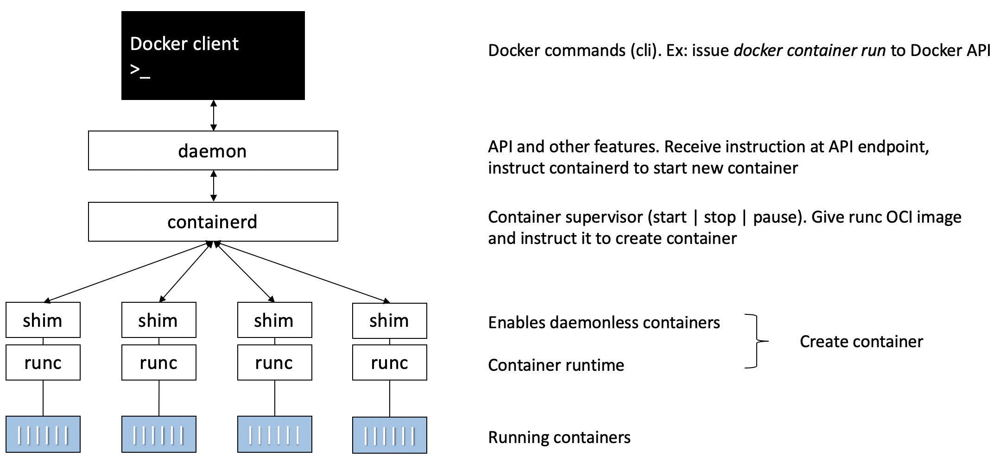

\newpage
The structure of this document is not the same as the one in the book. The installation of Docker is not covered, and only Linux examples are given (no Windows). All the examples can be reproduced if you have Docker, or within Play with Docker (<https://labs.play-with-docker.com/>). The summary is organized as follows: 
\tableofcontents
\newpage

```{r setup, include=FALSE, echo=FALSE}
knitr::opts_chunk$set(echo = TRUE)
library(docknitr)
```

# 1. Important concepts and definitions

## The past
Applications run businesses, and most of them run on servers.
In the past, we could only run 1 application per server. So, new application = buy a new server.
However, nobody knew the performance requirements of the new app -> they bought
big servers, which ended operating at 5-10% of their potential capacity.
It was a waste of resources.

## Virtual machines
Then came the VMs, which allowed running multiple applications on the same server.
It was a huge improvement, but there was still a problem: every VM requires its own dedicated OS and consume resources (CPU, RAM and storage). Also, every OS needs a license, patching and monitoring.
Finally, VMs are slow to boot and portability isn't great (migrating and moving VM workloads between hypervisors and cloudplatforms isn't easy. A hypervisor is a virtualization platform that allows multiple OS to work on the same physical machine).
Nowadays, VMs are still very common.

## Containers
Containers are a trendy virtualization technology that address the shortcomings of the VM model.
A container is similar to a VM, but every container does not require its own OS. All containers in a single host share a single OS, freeing up huge amounts of system resources and reducing licensing and monitoring costs.
Unlike VMs, containers are fast to start and ultra-portable: it's easy to move container workloads from a laptop to the cloud, and then to VMs or bare metal in a data center.
There are Linux and Windows containers. It is vital to understand that a running container shares the kernel of the host machine it is running on -> a containerized app designed to run on a host with a Windows kernel will not run on a Linux host.
But in practice, it is actually possible to run Linux containers on Windows machines.

## Images
An image is an object that contains an OS filesystem and an application (it's like a VM template). Every container is started from an image. So, an image is in fact a stopped container.
We can either create our own image, or use an existing one to start a container (see for example <https://hub.docker.com/>). Getting images onto the docker host is called "pulling".

## Docker
Containers have existed for a long time, but were complex and out of reach of most organizations.
Docker is the company that made containers simple, both for Linux and Windows. It basically creates and manages containers. Note that it is possible to run Linux containers on Mac using Docker for Mac.
Nowadays, Docker is a very popular container runtime but there are many others.
Docker consists of two major components: the Docker client and the Docker engine (or "daemon"). Once installed, the client-server connection can be tested with the command "docker version".

## Kubernetes
It is an open-source project from Google that has become the leading orchestrator of containerized apps.
An orchestrator is a software that helps deploying and managing containers. Kubernetes (k8s) is a higher-level platform than docker, and uses this latter as its default container runtime (it's Docker that starts and stops containers, pulls images, etc.). It is possible to swap out Docker for another container runtime. In the future, k8s might use containerd instead of Docker by default.

## DevOps
The DevOps term refers to a movement that aims to unite software development (Dev) and IT operations (Ops). Concretely, it consists of a set of practices that allow to shorten the development life cycle and provide continuous delivery. In a DevOps approach, we try to automate and monitor every step of the creation of a software from the development, integration, tests, delivery and deployment, exploitation and maintenance of infrastructures.
DevOps is an agile approach (unlike the waterfall approach), in which the product is frequently shown to the customer.

<!-- # ```{r engine="docker", image="ubuntu:latest", command="bash"} -->
<!-- # uname -a -->
<!-- # ``` -->

\newpage
# 2. Introduction

Let's introduce Docker in the DevOps perspective. 

## The Ops perspective

We will download an image, start a new container, log in to this container, run a command inside of it, and finally destroy it. The easiest way to reproduce the following commands is on Play with Docker (<https://labs.play-with-docker.com/>).

Let's start by pulling an image:
```{r}
# docker image pull ubuntu:latest
```
Note that "docker pull ubuntu:latest" also works. We can then see the image with the following command:
```{r}
# docker image ls
```
We can refer to the image with its ID (typing the first few characters of the ID is enough for Docker to figure out what image we're referring to). This image contains enough of an OS, code and dependencies to run the application it is designed for. In this case, the image has a stripped-down version of the Ubuntu Linux filesystem.

Now that we have an image, we can launch a container from it. The syntax is *docker container run \<image:version\> \<application/process\>* (we must specifiy an application or process):
```{r}
# docker container run -it ubuntu:latest /bin/bash
```
This command changes the shell prompt: this is because we are now in a Bash Shell on Ubuntu. Here, *docker container run* tells the Docker daemon (server) to start a new container. The flags *-it* tell Docker to make the container interactive and to attach our current shell to the container's terminal. The *\<image:version\>* is the latest version of Ubuntu, and the *\<application\>* we're running is /bin/bash.

In the container, we can list the running processes:
```{r}
# ps -elf
```
There are 2 processes: */bin/bash* and *ps -elf*. However, this latter stopped existing by the time the output was printed. In reality, there is only */bin/bash* running (it is optimal, nothing else is using resources).

We can exit the container with *Ctr-PQ* without killing it. This brings us back to our Docker host's terminal.
Now, if we check again the running processes with *ps -elf*, we see there are more than in the container.

We didn't kill the container, and we can see it with the following command:
```{r}
# docker container ls
```
The container is still running, and we can re-attach to it. The syntax is *docker container exec \<options\> \<container name/ID\> \<command/app\>*:
```{r}
# docker container exec -it determined_nash bash
```
Note that *determined_nash* was the name of my container. let's get out of the container with *Ctrl-PQ* and kill it:
```{r}
# docker container stop determined_nash
# docker container rm determined_nash
# docker container ls -a
```
The flag *-a* in the last command lists all the containers, even the ones that were stopped. It is possible to kill a container in one command, but it is considered a good practice to proceed in two steps. In short, this gives a chance to the application/process to stop properly.

## The Dev perspective

This time, we focus more on the application: we will clone a nodejs web app from Github, inspect its Dockerfile, containerize it, and run it as a container.
The linux app can be cloned from <https://github.com/nigelpoulton/psweb.git>:
```{r}
# git clone https://github.com/nigelpoulton/psweb.git
```
We can then change directory (with *cd*) into the cloned repo's directory and list its contents:
```{r}
# cd psweb
# ls -al
```
There is a *Dockerfile*, which is a document describing how to build an app into a Docker image. We can see the content of the file with the *cat* command:
```{r}
# cat Dockerfile
```
Each line of this file represents an instruction that is used to build an image. In this case, the instructions are:  
FROM alpine  
LABEL maintainer="nigelpoulton@hotmail.com"  
RUN apk add --update nodejs nodejs-npm  
COPY . /src  
WORKDIR /src  
RUN npm install  
EXPOSE 8080  
ENTRYPOINT ["node", "./app.js"]  

So, we use the Dockerfile to build a Docker image:
```{r}
# docker image build -t test:latest .
```
This commands creates a new image called *test:latest*, and we can make sure it was created with
```{r}
# docker image ls
```
We now have an image with the app inside. We can start a container from this image and test the app:
```{r}
# docker container run -d \
# --name web1 \
# --publish 8080:8080 \
# test:latest
```
To see the result (on Play With Docker), click on the button *OPEN PORT* above the terminal and type 8080 (otherwise open a browser and navigate to localhost:8080).
The process of building an image from code and then building a container from this image is called *containerizing* an app.

\newpage
# 3. Technical

## The docker engine (or server)

At the beginning, the docker engine had two major components:

- The Docker daemon: it used to be a monolithic binary that contained all the code for the Docker client, the API, the container runtime, image builds, and much more. This is not what Docker wanted (slow and hard to innovate), and the work of breaking apart the daemon into smaller tools is still an ongoing process. To this day, it has already seen all of the container execution and container runtime code entirely removed. Is is becoming more and more modular, and many components can be swapped, thanks to the OCI (Open Container Initiative) standards.

- LXC: provided the daemon with access to fundamental building-blocks of containers that existed in the Linux kernel (*namespaces* and *control groups*). Problems: LXC is Linux specific and Docker didn't want to rely on an external tool for the core of the project. They replaced LXC with their own platform-agnostic tool called *libcontainer*, which provides Docker with accesss to the fundamental container building-blocks that exist inside the kernel.

The current Docker engine architecture is the following.



The old monolithic daemon was broken down, giving birth to new layers:

- runc: tool that manages container runtime code. It's the reference implementation of the OCI container-runtime-spec. In fact, runc is a CLI wrapper for libcontainer. It has a single purpose: **create containers**.

- containerd: tool that used to only manage container lifecycle operations (*start*, *stop*, *pause*, *rm*, ...). It now also takes care of image management (push and pull, ...).

The daemon still performs image management, image builds, REST API, authentication, security, core networking and orchestration.

So, what happens when we create a new container via the docker CLI (the Docker client) ?
```{r}
# docker container run --name ctr1 -it alpine:latest sh
```
Based on Fig. 1, the Docker client converts the command into the appropriate API payload and POSTs it to the correct API endpoit.  
We saw that the REST API is implemented in the Daemon, which is the layer under the Docker client. Once the daemon receives the command to create a new container, it makes a call to containerd via a CRUD-style API over gRPC.  
Containerd converts the required Docker image into an OCI bundle and tells runc to use it to create a new container.  
Runc interfaces with the OS kernel to pull together all of the constructs necessary to create a container (namespaces, cgroups, ...). The container process is started as a child-process of runc, and as soon as it is started runc will exit. This means we can run hundreds of containers without having to run hundreds of runc instances.  
Once a container's parent runc process exits, the associated containerd-shim process becomes the container's parent. Among other things, shims have the responsibility to keep any stdin/stdout streams open (so that when the daemon is restarted, the container doesn't terminate due to pipes being closed) and to report the container's exit status back to the daemon.

The advantage of this model (code to start and manage containers out of the daemon) is that it makes it possible to perform maintenance and upgrades on the daemon without impacting running containers. In the old model, every daemon upgrade would kill all containers on the host.

In Linux, all these components are implemented in separate binaries: *dockerd* (docker daemon), *docker-containerd*, *docker-containerd-shim* and *docker-runc*.

## Images
